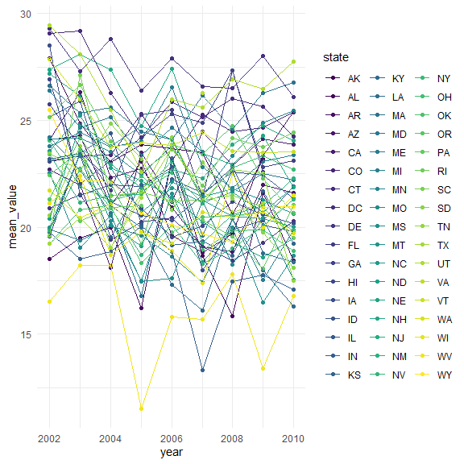

p8105\_hw3\_xy2517
================
Xuehan Yang
2021/10/15

``` r
library(tidyverse)
```

    ## -- Attaching packages --------------------------------------- tidyverse 1.3.1 --

    ## v ggplot2 3.3.5     v purrr   0.3.4
    ## v tibble  3.1.4     v dplyr   1.0.7
    ## v tidyr   1.1.3     v stringr 1.4.0
    ## v readr   2.0.1     v forcats 0.5.1

    ## -- Conflicts ------------------------------------------ tidyverse_conflicts() --
    ## x dplyr::filter() masks stats::filter()
    ## x dplyr::lag()    masks stats::lag()

``` r
library(p8105.datasets)

knitr::opts_chunk$set(
  fig.width = 6,
  fig.asp = 1,
  out.width = "90%"
)

theme_set(theme_minimal() + theme(legend.position = "bottom"))

options(
  ggplot2.continuous.colour = "viridis",
  ggplot2.continuous.fill = "viridis"
)

scale_colour_discrete = scale_colour_viridis_d
scale_fill_discrete = scale_fill_viridis_d
```

# Problem 1

## Data import and short description

``` r
data("instacart")
```

Instacart is an online grocery service that allows you to shop online
from local stores. The dataset represent a samplinf of products, users,
and purchases.

It cantains 1384617 observations of 131209 unique users, where each row
in the dataset is a product from an order. There are 15 variables in
this dataset, which include order\_id, product\_id,
add\_to\_cart\_order, reordered, user\_id, eval\_set, order\_number,
order\_dow, order\_hour\_of\_day, days\_since\_prior\_order,
product\_name, aisle\_id, department\_id, aisle, department.

Specifically, \* order\_dow is the day of the week on which the order
was placed. \* order\_hour\_of\_day if the hour of the day on which the
order was placed, from where we could see that people on average place
order at 13.6 o’clock. \* aisle\_id means the little categories of a
product like “yogurt” and “fresh fruits”. \* department\_id is a bigger
classification of a product like “produce” and “dairy eggs”.

## Exploratory data analysis

**Which aisles are the most items ordered from?**

``` r
aisle_df = instacart %>% 
  group_by(aisle) %>% 
  summarize(items_count = n()) %>% 
  arrange(desc(items_count))

head(aisle_df,3) %>% 
  knitr::kable()
```

| aisle                      | items\_count |
|:---------------------------|-------------:|
| fresh vegetables           |       150609 |
| fresh fruits               |       150473 |
| packaged vegetables fruits |        78493 |

There are 134 aisles there, fresh vegetables are the most items ordered
from.

**Make a barplot to show top Aisles and their items ordered.**

``` r
instacart %>% 
  group_by(aisle) %>% 
  summarize(items_count = n()) %>% 
  filter(items_count >= 10000) %>% 
  mutate(aisle = forcats::fct_reorder(aisle, items_count)) %>% 
  ggplot(aes(y = aisle, x = items_count, fill = aisle)) +
  geom_bar(stat = "identity") +
  labs(
    title = "Aisles and the number of items ordered",
    x = "Number of items",
    y = "Aisle name") + # Rename the labels
  theme(legend.position = "none") +
  scale_x_continuous(trans = "sqrt") # Making top lines shorter looks better 
```


**Table showing the top three ordered items in designated aisles**

``` r
popular3 = instacart %>% 
  filter(aisle %in% c("baking ingredients", "dog food care", "packaged vegetables fruits")) %>% 
  group_by(aisle, product_name) %>%
  summarize(item_count = n()) %>% 
  filter(min_rank(desc(item_count)) <= 3) %>% 
  arrange(desc(item_count))
```

    ## `summarise()` has grouped output by 'aisle'. You can override using the `.groups` argument.

``` r
popular3 %>% knitr::kable()
```

| aisle                      | product\_name                                 | item\_count |
|:---------------------------|:----------------------------------------------|------------:|
| packaged vegetables fruits | Organic Baby Spinach                          |        9784 |
| packaged vegetables fruits | Organic Raspberries                           |        5546 |
| packaged vegetables fruits | Organic Blueberries                           |        4966 |
| baking ingredients         | Light Brown Sugar                             |         499 |
| baking ingredients         | Pure Baking Soda                              |         387 |
| baking ingredients         | Cane Sugar                                    |         336 |
| dog food care              | Snack Sticks Chicken & Rice Recipe Dog Treats |          30 |
| dog food care              | Organix Chicken & Brown Rice Recipe           |          28 |
| dog food care              | Small Dog Biscuits                            |          26 |

**Ordered information about Pink Lady Apples and Coffee Ice Cream (2 x 7
table)**

``` r
meanhour = instacart %>% 
  filter(product_name == "Pink Lady Apples" | product_name == "Coffee Ice Cream") %>%
  mutate(as.character(order_dow)) %>% 
  mutate(
    order_dow = recode(
      order_dow,
      "0" = "Sun",
      "1" = "Mon",
      "2" = "Tue",
      "3" = "Wed",
      "4" = "Thur",
      "5" = "Fri",
      "6" = "Sat")) %>% 
  group_by(product_name, order_dow) %>% 
  summarize(u_hour = round(mean(order_hour_of_day), 1)) %>% 
  pivot_wider(
    names_from = order_dow,
    values_from = u_hour
  )
```

    ## `summarise()` has grouped output by 'product_name'. You can override using the `.groups` argument.

``` r
meanhour %>% knitr::kable()
```

| product\_name    |  Fri |  Mon |  Sat |  Sun | Thur |  Tue |  Wed |
|:-----------------|-----:|-----:|-----:|-----:|-----:|-----:|-----:|
| Coffee Ice Cream | 12.3 | 14.3 | 13.8 | 13.8 | 15.2 | 15.4 | 15.3 |
| Pink Lady Apples | 12.8 | 11.4 | 11.9 | 13.4 | 11.6 | 11.7 | 14.2 |

# Problem 2

## Do some data cleaning

``` r
data("brfss_smart2010")
```

``` r
brfss = brfss_smart2010 %>% 
  janitor::clean_names() %>% 
  rename(state = locationabbr, desc = locationdesc) %>% # rename 2 variables
  filter(response %in% c("Excellent","Very good","Good","Fair","Poor") & topic == "Overall Health") %>% 
  mutate(response = forcats::fct_relevel(response, c("Poor","Fair","Good","Very good","Excellent"))) # level from "Poor" to "Excellent"
```

    ## Warning in FUN(X[[i]], ...): strings not representable in native encoding will
    ## be translated to UTF-8

    ## Warning in FUN(X[[i]], ...): unable to translate '<U+00C4>' to native encoding

    ## Warning in FUN(X[[i]], ...): unable to translate '<U+00D6>' to native encoding

    ## Warning in FUN(X[[i]], ...): unable to translate '<U+00E4>' to native encoding

    ## Warning in FUN(X[[i]], ...): unable to translate '<U+00F6>' to native encoding

    ## Warning in FUN(X[[i]], ...): unable to translate '<U+00DF>' to native encoding

    ## Warning in FUN(X[[i]], ...): unable to translate '<U+00C6>' to native encoding

    ## Warning in FUN(X[[i]], ...): unable to translate '<U+00E6>' to native encoding

    ## Warning in FUN(X[[i]], ...): unable to translate '<U+00D8>' to native encoding

    ## Warning in FUN(X[[i]], ...): unable to translate '<U+00F8>' to native encoding

    ## Warning in FUN(X[[i]], ...): unable to translate '<U+00C5>' to native encoding

    ## Warning in FUN(X[[i]], ...): unable to translate '<U+00E5>' to native encoding

## Exploratory data analysis

**Which states were observed at 7 or more locations?**

``` r
states7 = 
  brfss %>% 
  filter(year == 2002 | year == 2010) %>% 
  select(state,desc,year) %>% 
  distinct() %>% 
  group_by(state, year) %>% 
  summarise(n_obs = n()) %>% 
  filter(n_obs >= 7)
```

    ## `summarise()` has grouped output by 'state'. You can override using the `.groups` argument.

In 2002, states CT, FL, MA, NC, NJ, PA were observed at 7 or more
locations. In 2010, states CA, CO, FL, MA, MD, NC, NE, NJ, NY, OH, PA,
SC, TX, WA were observed at 7 or more locations.

**Spaghetti plot**

``` r
brfss %>% 
  filter(response == "Excellent") %>% 
  group_by(year, state) %>% 
  summarise(mean_value = mean(data_value)) %>% 
  ggplot(aes(x = year, y = mean_value, color = state)) +
  geom_point() +
  geom_line() +
  theme(legend.position = "right")
```

    ## `summarise()` has grouped output by 'year'. You can override using the `.groups` argument.

    ## Warning: Removed 4 rows containing missing values (geom_point).

    ## Warning: Removed 3 row(s) containing missing values (geom_path).



``` r
  labs(
    x  = "Year",
    y = "Average data_value",
    title = "Average data_value over time"
  )
```

    ## $x
    ## [1] "Year"
    ## 
    ## $y
    ## [1] "Average data_value"
    ## 
    ## $title
    ## [1] "Average data_value over time"
    ## 
    ## attr(,"class")
    ## [1] "labels"
