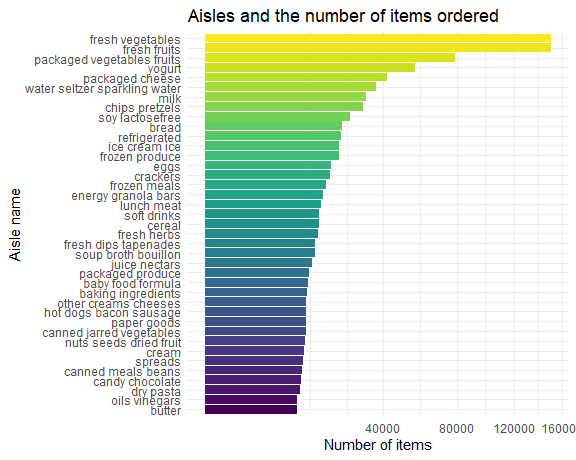

p8105\_hw3\_xy2517
================
Xuehan Yang
2021/10/15

``` r
library(tidyverse)
```

    ## -- Attaching packages --------------------------------------- tidyverse 1.3.1 --

    ## v ggplot2 3.3.5     v purrr   0.3.4
    ## v tibble  3.1.4     v dplyr   1.0.7
    ## v tidyr   1.1.3     v stringr 1.4.0
    ## v readr   2.0.1     v forcats 0.5.1

    ## -- Conflicts ------------------------------------------ tidyverse_conflicts() --
    ## x dplyr::filter() masks stats::filter()
    ## x dplyr::lag()    masks stats::lag()

``` r
library(p8105.datasets)

knitr::opts_chunk$set(
  fig.width = 6,
  fig.asp = 1,
  out.width = "90%"
)

theme_set(theme_minimal() + theme(legend.position = "bottom"))

options(
  ggplot2.continuous.colour = "viridis",
  ggplot2.continuous.fill = "viridis"
)

scale_colour_discrete = scale_colour_viridis_d
scale_fill_discrete = scale_fill_viridis_d
```

# Problem 1

## Data import and short description

``` r
data("instacart")
```

Instacart is an online grocery service that allows you to shop online
from local stores. The dataset represent a samplinf of products, users,
and purchases.

It cantains 1384617 observations of 131209 unique users, where each row
in the dataset is a product from an order. There are 15 variables in
this dataset, which include order\_id, product\_id,
add\_to\_cart\_order, reordered, user\_id, eval\_set, order\_number,
order\_dow, order\_hour\_of\_day, days\_since\_prior\_order,
product\_name, aisle\_id, department\_id, aisle, department.

Specifically, \* order\_dow is the day of the week on which the order
was placed. \* order\_hour\_of\_day if the hour of the day on which the
order was placed, from where we could see that people on average place
order at 13.6 o’clock. \* aisle\_id means the little categories of a
product like “yogurt” and “fresh fruits”. \* department\_id is a bigger
classification of a product like “produce” and “dairy eggs”.

## Exploratory data analysis

**Which aisles are the most items ordered from?**

``` r
aisle_df = instacart %>% 
  group_by(aisle) %>% 
  summarize(items_count = n()) %>% 
  arrange(desc(items_count))

head(aisle_df,3) %>% 
  knitr::kable()
```

| aisle                      | items\_count |
|:---------------------------|-------------:|
| fresh vegetables           |       150609 |
| fresh fruits               |       150473 |
| packaged vegetables fruits |        78493 |

There are 134 aisles there, fresh vegetables are the most items ordered
from.

**Make a barplot to show top Aisles and their items ordered.**

``` r
instacart %>% 
  group_by(aisle) %>% 
  summarize(items_count = n()) %>% 
  filter(items_count >= 10000) %>% 
  mutate(aisle = forcats::fct_reorder(aisle, items_count)) %>% 
  ggplot(aes(y = aisle, x = items_count, fill = aisle)) +
  geom_bar(stat = "identity") +
  labs(
    title = "Aisles and the number of items ordered",
    x = "Number of items",
    y = "Aisle name") + # Rename the labels
  theme(legend.position = "none") +
  scale_x_continuous(trans = "sqrt") # Making top lines shorter looks better 
```



**3×3 table**

``` r
popular3 = instacart %>% 
  select(aisle, product_name) %>% 
  filter(aisle == c("baking ingredients", "dog food care", "packaged vegetables fruits")) %>% 
  group_by(aisle, product_name) %>%
  summarize(item_count = n()) %>% 
  filter(min_rank(desc(item_count)) <= 3) %>% 
  arrange(desc(item_count))
```

    ## `summarise()` has grouped output by 'aisle'. You can override using the `.groups` argument.

``` r
popular3 %>% knitr::kable()
```

| aisle                      | product\_name                                   | item\_count |
|:---------------------------|:------------------------------------------------|------------:|
| packaged vegetables fruits | Organic Baby Spinach                            |        3324 |
| packaged vegetables fruits | Organic Raspberries                             |        1920 |
| packaged vegetables fruits | Organic Blueberries                             |        1692 |
| baking ingredients         | Light Brown Sugar                               |         157 |
| baking ingredients         | Pure Baking Soda                                |         140 |
| baking ingredients         | Organic Vanilla Extract                         |         122 |
| dog food care              | Organix Grain Free Chicken & Vegetable Dog Food |          14 |
| dog food care              | Organix Chicken & Brown Rice Recipe             |          13 |
| dog food care              | Original Dry Dog                                |           9 |
