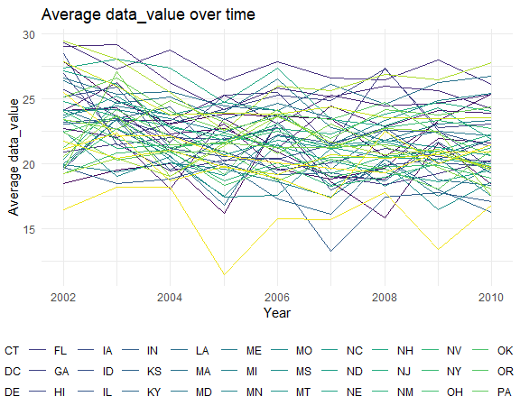

p8105\_hw3\_xy2517
================
Xuehan Yang
2021/10/15

**Used library and default plot setting.**

``` r
library(tidyverse)
library(p8105.datasets)

knitr::opts_chunk$set(
  fig.width = 6,
  fig.asp = 0.8,
  out.width = "90%"
)

theme_set(theme_minimal() + theme(legend.position = "bottom"))

options(
  ggplot2.continuous.colour = "viridis",
  ggplot2.continuous.fill = "viridis"
)

scale_colour_discrete = scale_colour_viridis_d
scale_fill_discrete = scale_fill_viridis_d
```

# Problem 1

## Data import and short description

``` r
data("instacart")
```

| order\_id | product\_id | add\_to\_cart\_order | reordered | user\_id | eval\_set | order\_number | order\_dow | order\_hour\_of\_day | days\_since\_prior\_order | product\_name    | aisle\_id | department\_id | aisle  | department |
|----------:|------------:|---------------------:|----------:|---------:|:----------|--------------:|-----------:|---------------------:|--------------------------:|:-----------------|----------:|---------------:|:-------|:-----------|
|         1 |       49302 |                    1 |         1 |   112108 | train     |             4 |          4 |                   10 |                         9 | Bulgarian Yogurt |       120 |             16 | yogurt | dairy eggs |

Instacart is an online grocery service that allows you to shop online
from local stores. The dataset represent a samplinf of products, users,
and purchases.

It cantains 1384617 observations of 131209 unique users, where each row
in the dataset is a product from an order. There are 15 variables in
this dataset, which include order\_id, product\_id,
add\_to\_cart\_order, reordered, user\_id, eval\_set, order\_number,
order\_dow, order\_hour\_of\_day, days\_since\_prior\_order,
product\_name, aisle\_id, department\_id, aisle, department.

Specifically,

-   order\_dow is the day of the week on which the order was placed.
-   order\_hour\_of\_day if the hour of the day on which the order was
    placed, from where we could see that people on average place order
    at 13.6 o’clock.
-   aisle\_id means the little categories of a product like “yogurt” and
    “fresh fruits”.
-   department\_id is a bigger classification of a product like
    “produce” and “dairy eggs”.

## Exploratory data analysis

**Which aisles are the most items ordered from?**

``` r
aisle_df = instacart %>% 
  group_by(aisle) %>% 
  summarize(items_count = n()) %>% 
  arrange(desc(items_count))

head(aisle_df,3) %>% 
  knitr::kable()
```

| aisle                      | items\_count |
|:---------------------------|-------------:|
| fresh vegetables           |       150609 |
| fresh fruits               |       150473 |
| packaged vegetables fruits |        78493 |

There are 134 aisles there, fresh vegetables are the most items ordered
from.

**Make a barplot to show top Aisles and their items ordered.**

``` r
instacart %>% 
  group_by(aisle) %>% 
  summarize(items_count = n()) %>% 
  filter(items_count >= 10000) %>% 
  mutate(aisle = forcats::fct_reorder(aisle, items_count)) %>% 
  ggplot(aes(y = aisle, x = items_count, fill = aisle)) +
  geom_bar(stat = "identity") +
  labs(
    title = "Aisles and the number of items ordered",
    x = "Number of items",
    y = "Aisle name") + # Rename the labels
  theme(legend.position = "none") +
  scale_x_continuous(
    trans = "sqrt",
    breaks = c(10000, 20000, 40000, 80000, 160000),
    labels = c("10000","20000","40000","80000", "160000")) # Making top lines shorter looks better 
```


Top three aisles are fresh vegetables, fresh fruits and packaged
vegetables fruits. The differences in the number of items ordered from
each aisle were big so I transferred the scale of number of items into
sqrt.

**Table showing the top three ordered items in designated aisles**

``` r
popular3 = instacart %>% 
  filter(aisle %in% c("baking ingredients", "dog food care", "packaged vegetables fruits")) %>% 
  group_by(aisle, product_name) %>%
  summarize(item_count = n()) %>% 
  filter(min_rank(desc(item_count)) <= 3) %>% 
  arrange(desc(item_count))

popular3 %>% knitr::kable()
```

| aisle                      | product\_name                                 | item\_count |
|:---------------------------|:----------------------------------------------|------------:|
| packaged vegetables fruits | Organic Baby Spinach                          |        9784 |
| packaged vegetables fruits | Organic Raspberries                           |        5546 |
| packaged vegetables fruits | Organic Blueberries                           |        4966 |
| baking ingredients         | Light Brown Sugar                             |         499 |
| baking ingredients         | Pure Baking Soda                              |         387 |
| baking ingredients         | Cane Sugar                                    |         336 |
| dog food care              | Snack Sticks Chicken & Rice Recipe Dog Treats |          30 |
| dog food care              | Organix Chicken & Brown Rice Recipe           |          28 |
| dog food care              | Small Dog Biscuits                            |          26 |

Although all of them are top three ordered items, the number of items
ordered differed greatly in different aisles.

**Ordered information about Pink Lady Apples and Coffee Ice Cream (2 x 7
table)**

``` r
meanhour = instacart %>% 
  filter(product_name == "Pink Lady Apples" | product_name == "Coffee Ice Cream") %>%
  mutate(as.character(order_dow)) %>% 
  mutate(
    order_dow = recode(
      order_dow,
      "0" = "Sun",
      "1" = "Mon",
      "2" = "Tue",
      "3" = "Wed",
      "4" = "Thur",
      "5" = "Fri",
      "6" = "Sat"),
    order_dow = forcats::fct_relevel(order_dow, c("Sun", "Mon", "Tue", "Wed", "Thur", "Fri", "Sat"))) %>% 
  group_by(product_name, order_dow) %>% 
  summarize(u_hour = round(mean(order_hour_of_day), 1)) %>% 
  pivot_wider(
    names_from = order_dow,
    values_from = u_hour
  )

meanhour %>% knitr::kable()
```

| product\_name    |  Sun |  Mon |  Tue |  Wed | Thur |  Fri |  Sat |
|:-----------------|-----:|-----:|-----:|-----:|-----:|-----:|-----:|
| Coffee Ice Cream | 13.8 | 14.3 | 15.4 | 15.3 | 15.2 | 12.3 | 13.8 |
| Pink Lady Apples | 13.4 | 11.4 | 11.7 | 14.2 | 11.6 | 12.8 | 11.9 |

Coffee Ice Cream is on average ordered later than Pink Lady Apples.

# Problem 2

## Do some data cleaning

``` r
data("brfss_smart2010")
```

``` r
brfss = brfss_smart2010 %>% 
  janitor::clean_names() %>% 
  rename(state = locationabbr, desc = locationdesc) %>% # rename 2 variables
  filter(response %in% c("Excellent","Very good","Good","Fair","Poor") & topic == "Overall Health") %>% 
  mutate(response = forcats::fct_relevel(response, c("Poor","Fair","Good","Very good","Excellent"))) # level from "Poor" to "Excellent"
```

## Exploratory data analysis

**Which states were observed at 7 or more locations?**

``` r
states7 = 
  brfss %>% 
  filter(year == 2002 | year == 2010) %>% 
  select(state,desc,year) %>% 
  distinct() %>% # drop the duplicate
  group_by(state, year) %>% 
  summarise(n_obs = n()) %>% 
  filter(n_obs >= 7)
```

In 2002, states CT, FL, MA, NC, NJ, PA were observed at 7 or more
locations. In 2010, states CA, CO, FL, MA, MD, NC, NE, NJ, NY, OH, PA,
SC, TX, WA were observed at 7 or more locations.

**Spaghetti plot**

``` r
brfss %>% 
  filter(response == "Excellent" ) %>% 
  group_by(year, state) %>% 
  summarise(mean_value = mean(data_value, na.rm = TRUE)) %>% 
  ggplot(aes(x = year, y = mean_value, color = state)) +
  geom_line() +
  labs(
    x  = "Year",
    y = "Average data_value",
    title = "Average data_value over time"
  ) +
  guides(color = guide_legend(nrow = 3))   #Accurately change legend into 3 rows
```



**Two panel plots**

``` r
brfss %>% 
  filter(year %in% c(2006, 2010)) %>% 
  ggplot(aes(x = data_value)) +
  geom_density(aes(fill = response), alpha = 0.7) +
  facet_grid(.~ year) +
  labs(
    x = "Data_value",
    y = "Density",
    title = "Distribution of data_value for 5 responses 2006 vs.2010"
  )
```


# Problem 3

## Load, tidy and wrangle data.

``` r
accel_df = read_csv("./data/accel_data.csv") %>% 
  janitor::clean_names() %>% 
  mutate(
    day = forcats::fct_relevel(day, c("Sunday", "Monday", "Tuesday", "Wednesday", "Thursday", "Friday", "Saturday")), #encode day with reasonable classes
    is_weekend = case_when(
      day %in% c("Saturday","Sunday") ~ "weekend",
      day %in% c("Monday", "Tuesday", "Wednesday", "Thursday", "Friday") ~ "weekday"
    )) %>% # add new variable "is_weekend"
  relocate(week, day_id, day, is_weekend, everything())
```

This dataset uses five weeks of accelerometer data collected on a 63
year-old male with BMI 25 who was diagnosed with congestive heart
failure. Each row represents one day and each activity\_\* represents
the activity acounts for that minute. There are 1444 variables including
1440 activity counts in each minute of a day and four week and day
variables. The number of observations were 35.

## Aggregate accross minutes to create a total activity variable for each day

``` r
accel_df %>% 
  pivot_longer(
    activity_1:activity_1440,
    names_to = "minute",
    values_to = "activity_num"
  ) %>% 
  group_by(week,day) %>% 
  summarise(total_activity = round(sum(activity_num),0)) %>% 
  pivot_wider(
    names_from = day,
    values_from = total_activity
  ) %>% 
  knitr::kable()
```

| week | Sunday | Monday | Tuesday | Wednesday | Thursday | Friday | Saturday |
|-----:|-------:|-------:|--------:|----------:|---------:|-------:|---------:|
|    1 | 631105 |  78828 |  307094 |    340115 |   355924 | 480543 |   376254 |
|    2 | 422018 | 295431 |  423245 |    440962 |   474048 | 568839 |   607175 |
|    3 | 467052 | 685910 |  381507 |    468869 |   371230 | 467420 |   382928 |
|    4 | 260617 | 409450 |  319568 |    434460 |   340291 | 154049 |     1440 |
|    5 | 138421 | 389080 |  367824 |    445366 |   549658 | 620860 |     1440 |

-   Trend 1: In the first two weeks, the activity counts in weekdays
    were increasing.
-   Trend 2: The fluctuation of activity counts of a day seemed less
    during weekdays. However, these two trends are not apparent and
    could be not generalized to whole observation period.

## Inspection activity over the course of the day

``` r
accel_df %>% 
  pivot_longer(
    activity_1:activity_1440,
    names_to = "minute",
    names_prefix = "activity_",
    values_to = "activity_num"
  ) %>% 
  mutate(
    minute = as.double(minute),
    hour = ceiling(minute/60)) %>% # if I want to change unit from minute to hour
  ggplot(aes(x = minute, y = activity_num, group = day_id)) + # draw lines according to each day.
  geom_line(aes(color = day)) + # use color to indicate day of the week
  scale_x_continuous(
    breaks = c(0, 360, 720, 1080, 1440),
    labels = c("0:00AM", "6:00AM", "12:00PM", "6:00PM", "11:59PM")
  ) +
  labs(
    x = "Time of a day",
    y = "The number of activities",
    title = "24-hour activity time courses for each day"
  )
```


**Conclusions:**

-   From the minutes aspect, this patient conducted less activities
    during 10:00PM to 6:00AM when he was asleep and more activities
    during waking hours. Besides, there were an increasing trend in the
    number of activities during the day. The highly active periods fell
    around 7:00AM, 12:00PM, 5:00PM and 8:00PM.
-   From the day aspect, the patient was more active around 12:00PM at
    the beginning of a week from Sunday to Tuesday which showed by blue
    lines in the middle and more active around 9:00PM at the end of a
    week that was showed by green lines on the right.

**Turn unit from minute into hour**

``` r
accel_df %>% 
  pivot_longer(
    activity_1:activity_1440,
    names_to = "minute",
    names_prefix = "activity_",
    values_to = "activity_num"
  ) %>% 
  mutate(
    minute = as.double(minute),
    hour = ceiling(minute/60)) %>% # change unit from minute to hour
  group_by(day_id,day,hour) %>% 
  summarise(total_act = round(mean(activity_num),0)) %>% 
  ggplot(aes(x = hour, y = total_act, group = day_id)) + # draw lines according to each day
  geom_line(aes(color = day)) + # use color to indicate day of the week
  scale_x_continuous(
    breaks = c(1, 6, 12, 18, 24),
    labels = c("1", "6", "12", "18", "24")
  ) +
  labs(
    x = "Hour of a day",
    y = "The number of activities",
    title = "24-hour activity time courses for each day"
  )
```

    ## `summarise()` has grouped output by 'day_id', 'day'. You can override using the `.groups` argument.


This can make the line more clear. Conclusions are the same as above.
